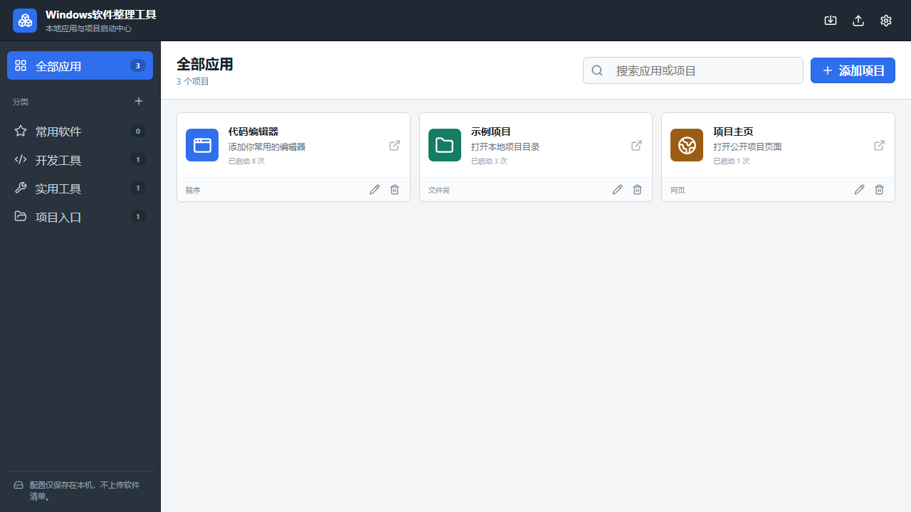

# 软件启动台

一个给 Windows 整理常用软件、文件夹和项目入口的小工具。

平时电脑里装的软件、项目目录和常用网页越来越多，靠桌面快捷方式不太好找，就做了这个。按分类放好，之后可以搜索、拖动排序，点一下就打开。



[下载](https://github.com/csjfpv/Windows-Software-Organizer/releases/latest) · [提问题](https://github.com/csjfpv/Windows-Software-Organizer/issues) · [更新记录](https://github.com/csjfpv/Windows-Software-Organizer/releases)

## 能做什么

- 给程序、文件、文件夹和网页建入口
- 分类、搜索和拖动排序
- 给一个路径就自动识别类型、分类并生成入口
- 需要时才在编辑里设置启动参数和工作目录
- 导入、导出自己的配置
- 点击后从开始菜单挑选软件，确认后才加入列表
- 程序入口默认显示 Windows 原始图标
- 不需要登录账号，不扫描个人文件夹或自动导入软件
- 一键复制“交给 AI 管理”提示词，让 Agent 按当前分类维护启动台

默认使用“仅添加入口”时不会移动原文件。对便携软件和普通文件夹，可以明确选择“收纳并移动”，经安全预检和确认后统一搬到自选收纳目录；安装器管理的软件、系统目录、Web Coding 和 AI 编程项目会保留原位。

## 下载

Release 页面有两个版本：

- `Software-Launchpad-Setup.exe`：安装版
- `Software-Launchpad-Portable.exe`：便携版，下载后直接运行

也可以下载 `SHA256SUMS.txt` 校验文件。当前安装包没有代码签名，第一次运行时 Windows 可能会弹出未知发布者提示，只建议从本仓库的 Release 页面下载。

## 用法

最简单的用法是点“添加路径”：粘贴或选择一个程序、文件夹或文件路径，启动台会自动识别类型、取名称、归类并显示原图标。可以选择“仅添加入口”，也可以对预检通过的便携软件和普通文件夹选择“收纳并移动”。移动使用事务日志；同盘安全移动，跨盘复制并校验后会切换入口并保留明确命名的旧副本，供用户验证后再人工处理。配置提交前失败会回滚，提交后不会删除新位置。

新装软件也可以点“从开始菜单添加”，勾选需要的项目后确认加入。只有没有自动识别成功，或想改名称、分类、启动参数时，才需要点卡片上的编辑。

让 Codex、DeepSeek、Harness 等 Agent 帮忙安装或整理软件时，点顶栏“交给 AI 管理”，复制提示词后直接发给 Agent。提示词每次都会带入当前分类和这台电脑的启动台配置路径，明确授权 Agent 新建、重命名、排序或删除启动台分类和入口；当现有分类不合适时，Agent 可以按用途新建清晰分类。它还给出稳定的分类模型：社交平台、流媒体平台、Vibe Coding 工具、Web 编程、开发环境与依赖、专业工具、远程与网络、日常软件、SDK 与说明、项目源码、项目产出软件。项目源码只保留原项目目录入口；交付软件统一放在专门的项目产出软件目录，不能把源码、build、dist、固件、日志、备份或临时目录混进去。该授权只适用于启动台配置。Agent 不得任意扫描电脑或直接移动原文件；确需整理时必须使用启动台内置的“收纳并移动”流程，并由用户逐项确认。

配置保存在本机。导入别人的配置前最好先看一眼内容，里面可能带有路径和启动参数。导出的 JSON 也可能包含自己的本机路径，发给别人前记得处理一下。

## 自己编译

需要 Windows、Node.js 20+ 和 pnpm。

```powershell
pnpm install
pnpm dev
```

打包 Windows 版本：

```powershell
pnpm lint
pnpm test
pnpm package:win
```

## 其他

- [SECURITY.md](SECURITY.md)：安全相关说明
- [PRIVACY.md](PRIVACY.md)：隐私说明
- [CONTRIBUTING.md](CONTRIBUTING.md)：提交代码前可以看看
- [LICENSE](LICENSE)：MIT License

这是一个独立的小工具，和其他同类软件没有关系。第三方开源依赖和素材来源分别在 [THIRD_PARTY_NOTICES.md](THIRD_PARTY_NOTICES.md) 与 [ASSET_SOURCES.md](ASSET_SOURCES.md)。
